# Inspo Teardowns — Look & Feel of Each Reference

<aside>
🔍

**Purpose:** this page describes the exact look and feel of each of the thirteen inspiration references for the Continuity build, so Cursor can design from them directly. It is purely descriptive — no prescriptions, no mapping to past mockups. Export as `reference/inspo-teardowns.md`.

</aside>

The references fall into two groups: six live US home-care competitor sites, and seven agency concept designs studied from screenshots. Each entry covers colours, typography, layout, UI detail, imagery, signature moves and overall feel.

---

## 1 · Home Instead (live site, US/UK)

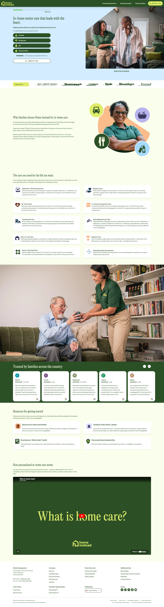

- **Colours:** muted plum and warm beige neutrals on white; restrained, grown-up, low-saturation.
- **Typography:** classic serif headlines paired with a humanist sans body; editorial and brochure-like; generous heading sizes.
- **Layout:** lots of white space; the hero leads with **audience self-segmentation** ("care for my mum", "care for me") before anything else; the local-office finder is prominent near the top.
- **UI detail:** large soft-cornered cards; quiet, low-contrast buttons; mega-menu navigation with many levels.
- **Imagery:** the sector's best photography — real-feeling carer-and-client moments, natural light, domestic settings (kitchens, sofas, gardens).
- **Signature moves:** the visitor chooses *who the care is for* in one tap before reading anything; photography carries the warmth while the UI stays neutral.
- **Overall feel:** the trusted national brand. Warm but unmistakably corporate at scale.
- **Expert read:** editorial 12-column grid with wide outer margins; type hierarchy built on a modest ~1.25 scale so the serif display never shouts. Colour proportion is roughly 80% neutral with plum reserved for interactive elements — the photography supplies nearly all of the page's saturation. Depth is almost flat: hierarchy comes from scale and whitespace, not elevation. The audience selector is textbook Hick's-law reduction — one decision, then a tailored path.
- **Vibe:** in UI UX Pro Max terms, **Editorial Grid / Magazine** crossed with **Accessible & Ethical**, on a **Storytelling-Driven** landing pattern. The mood is Sunday-supplement: unhurried, literate, quietly affluent — a brand that has nothing to prove.

## 2 · Right at Home (live site, US)

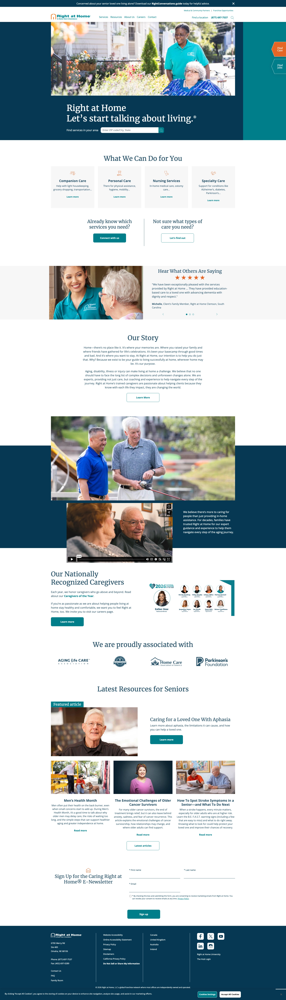

- **Colours:** American corporate red and navy on white; high-energy, high-urgency accents.
- **Typography:** bold condensed sans headlines; dense information hierarchy.
- **Layout:** location-first architecture — every region gets its own page with genuinely local detail (staff names, town references, a local phone number).
- **UI detail:** repeated CTA bars between sections; testimonial carousels; award and badge rows.
- **Imagery:** mixed stock and real photography; somewhat staged-feeling.
- **Signature moves:** localisation done properly — the region pages read like they were written by someone who lives there.
- **Overall feel:** competent, conversion-driven, slightly hard-sell.
- **Expert read:** tight leading and heavy weights compress the vertical rhythm — information-dense F-pattern scanning rather than editorial pacing. Red is a pure von Restorff isolation effect on CTAs: it converts, but keeps emotional arousal high. The carousels violate content-visibility heuristics — rotation hides social proof most users never see.
- **Vibe:** **Conversion-Optimized** landing pattern in corporate **Flat Design**. Insurance-brochure urgency — efficient, transactional, a little breathless; it sells competence but never comfort.

## 3 · Comfort Keepers (live site, US)

- **Colours:** optimistic yellow and mid blue; bright and upbeat.
- **Typography:** rounded, friendly sans throughout; soft letterforms.
- **Layout:** icon-led service grids; cost and funding information surfaced unusually early and plainly.
- **UI detail:** icon + title + blurb cards in long grids; chunky, high-contrast buttons.
- **Imagery:** smiling-senior stock photography, heavily posed.
- **Signature moves:** treats cost transparency as a selling point rather than something to hide behind a form.
- **Overall feel:** cheerful brochure; warmth achieved through colour rather than evidence.
- **Expert read:** the saturated yellow/blue pairing plus fully rounded letterforms produces a consumer-retail schema rather than a healthcare one. The icon grids give every card identical visual weight, so nothing guides the eye — uniform emphasis is no emphasis. Radius and elevation vary between components: a sign of accreted rather than systemised design.
- **Vibe:** **Vibrant & Block-based** flat design on a **Feature-Rich Showcase** pattern. Daytime-TV cheerfulness — bright, well-meaning, slightly plastic; the optimism is applied like paint rather than earned.

## 4 · Visiting Angels (live site, US)

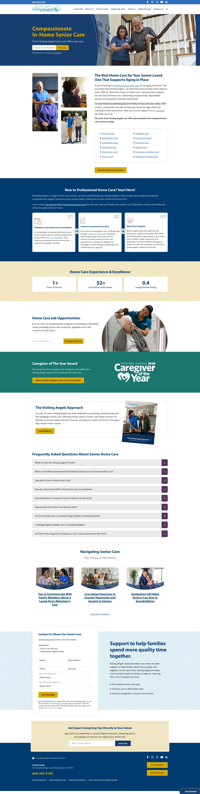

- **Colours:** traditional navy and gold.
- **Typography:** serif headings with ornamental flourishes; the oldest-feeling brand in the set.
- **Layout:** dense text blocks; long-form pages; the **phone number is enormous and ever-present** in the header.
- **UI detail:** heavy paragraphs, dated button styles, conventional multi-column footers.
- **Imagery:** angel motif throughout; conservative photography.
- **Signature moves:** the phone *is* the website — every page funnels toward the call, and the number is impossible to miss.
- **Overall feel:** old-fashioned and earnest; clearly converts an older demographic via the phone.
- **Expert read:** typographic hygiene is the weakness — long measures past 90ch, small body sizes, cramped paragraph spacing. But the giant header phone is a deliberate affordance for low-digital-confidence users: it surfaces the one interface they already trust. Navy/gold is the classic authority-and-tradition colour schema, executed without modern restraint.
- **Vibe:** pre-system web — legacy **Trust & Authority** with no modern style framework at all. Parish-newsletter energy: earnest, wordy, devout about the phone number; trustworthy the way an old institution is trustworthy.

## 5 · Nurse Next Door (live site, US/CA)

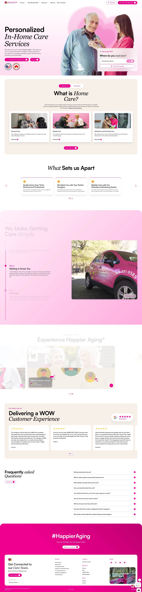

- **Colours:** hot pink, fearlessly committed — the most memorable palette in the sector; everything else stays neutral so the pink owns the page.
- **Typography:** big, confident sans; punchy short lines.
- **Layout:** story-led ("Happier Aging" narrative); bold full-bleed colour sections.
- **UI detail:** playful curves, rounded everything, badge-style graphics.
- **Imagery:** vivid, joyful, magazine-quality photography.
- **Signature moves:** total commitment to one owned colour builds instant brand memory; the storytelling reframes care as a positive life chapter rather than a crisis.
- **Overall feel:** a consumer lifestyle brand that happens to do home care. Confident, occasionally jokey.
- **Expert read:** a masterclass in figure-ground — the pink survives full saturation because colour proportion is close to 90/10 white-to-pink. Display type is set large and tight with confident hierarchy drops. The photography is art-directed for motion and laughter (high-arousal positive affect), the exact inverse of the sector's sombre default grade.
- **Vibe:** **Vibrant & Block-based** with **Kinetic Typography** confidence on a **Hero-Centric** pattern. Lifestyle-magazine-cover energy — glossy, joyful, audacious; care reframed as a positive brand experience.

## 6 · Griswold (live site, US)

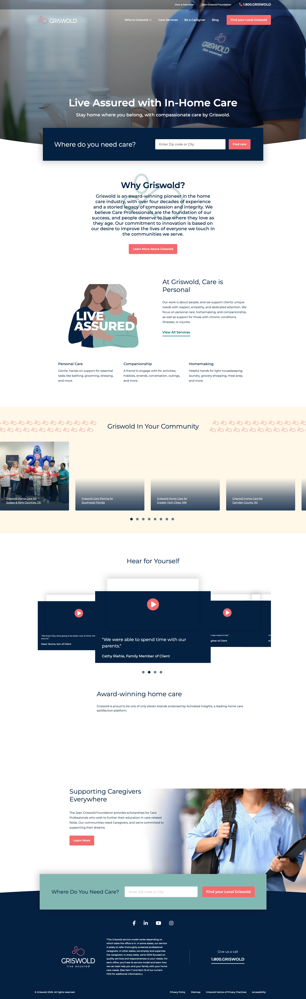

- **Colours:** heritage green and navy; sober and muted.
- **Typography:** plain, slightly dated sans; mixed weights.
- **Layout:** flat, plain pages; **transparent pricing published openly**; "since 1982" heritage positioning up front.
- **UI detail:** simple cards, minimal effects, almost no animation.
- **Imagery:** modest, conventional.
- **Signature moves:** radical plainness — real prices in plain English and a heritage claim doing the persuasion instead of design.
- **Overall feel:** plain-spoken and trustworthy, visually unremarkable.
- **Expert read:** almost no typographic hierarchy — headings differ from body by size alone, not weight or colour, so pages read flat. There is no real design system; trust is carried entirely by content decisions (published prices, heritage dates). A useful study in message-over-craft: it works, but nothing about it is transferable as visual design.
- **Vibe:** **Minimal & Direct** by accident rather than intent — no recognisable style system. Family-solicitor's-letterhead energy: dry, factual, dependable, visually mute.

## 7 · Plum NDIS concept (agency concept, Adelaide)

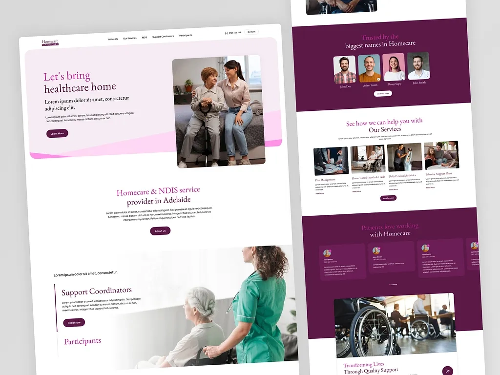

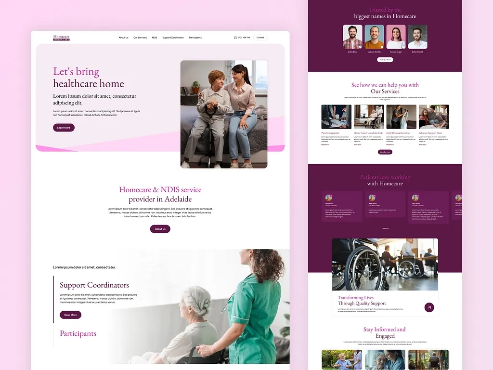

- **Colours:** plum/magenta family on warm white.
- **Typography:** strong sans headings with **serif italic accent words** dropped into headlines for emphasis.
- **Layout:** the best band rhythm in the set — the page is structured by **alternating tinted full-bleed sections** (warm white → pale plum tint → white → dark plum), ending in a **dark plum pre-footer CTA band** where the button inverts to white.
- **Hero anatomy:** a two-column composition sitting on a pale tinted panel — headline (with the serif italic accent word) and the action pair on the left, one large rounded-mask photo on the right.
- **UI detail:** pill-shaped chips and badges; generous padding; flat cards sitting on the tinted bands; soft rounded corners throughout.
- **Imagery:** lifestyle photos in rounded masks.
- **Signature moves:** colour does the sectioning — you always know where one section ends and the next begins without a single divider line; the single dark band at the end gives the page a confident full stop.
- **Overall feel:** polished, calm, editorial. Proof that a purple-family care brand can feel premium rather than childish.
- **Expert read:** the band tints are tonal steps of a single hue — monochromatic harmony — which is why the page feels coherent rather than stripy. Spacing reads as a disciplined 8pt rhythm with generous (~120px) section padding; whitespace is doing the premium signalling. The serif italic is a controlled style-contrast device: one word per heading, never more. The dark closing band is tonal inversion used as narrative punctuation — the page audibly "ends".
- **Vibe:** **Soft UI Evolution** (soft depth, calming, premium feel, organic warmth) on a **Hero-Centric + Social Proof** pattern — the textbook recommendation for premium wellness brands, executed properly. Boutique-hotel calm: quiet money, warm lighting, everything considered.

## 8 · Blue Water Homecare concept (agency concept, teal)

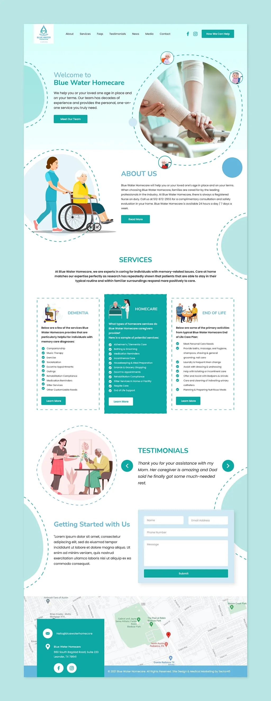

- **Colours:** teal/aqua on white.
- **Typography:** clean geometric sans.
- **Layout:** sections visually connected by **dashed doodle paths** that wind down the page; organic blob shapes sit behind content.
- **UI detail:** flat illustrations of carers mixed with photography; wavy section transitions; rounded cards.
- **Imagery:** illustration-photo hybrid.
- **Signature moves:** the winding dotted path as a storytelling device guiding the eye from section to section.
- **Overall feel:** friendly but template-like; the decoration carries the warmth more than the content does.
- **Expert read:** the doodle paths deliberately break grid alignment to manufacture informality, but they also break scanning paths — the eye follows the decoration instead of the content hierarchy. Mixing flat illustration with photography creates rendering-style discord: two reality levels on one page. Tonal depth is shallow (teal and white with few intermediate tints), so sections blur into each other.
- **Vibe:** **Claymorphism-adjacent**, illustration-led flat design. Children's-picture-book friendliness applied to an adult decision — sweet, soft, and slightly infantilising for someone arranging care for a parent.

## 9 · Elite Home Care concept (agency concept, navy/lavender)

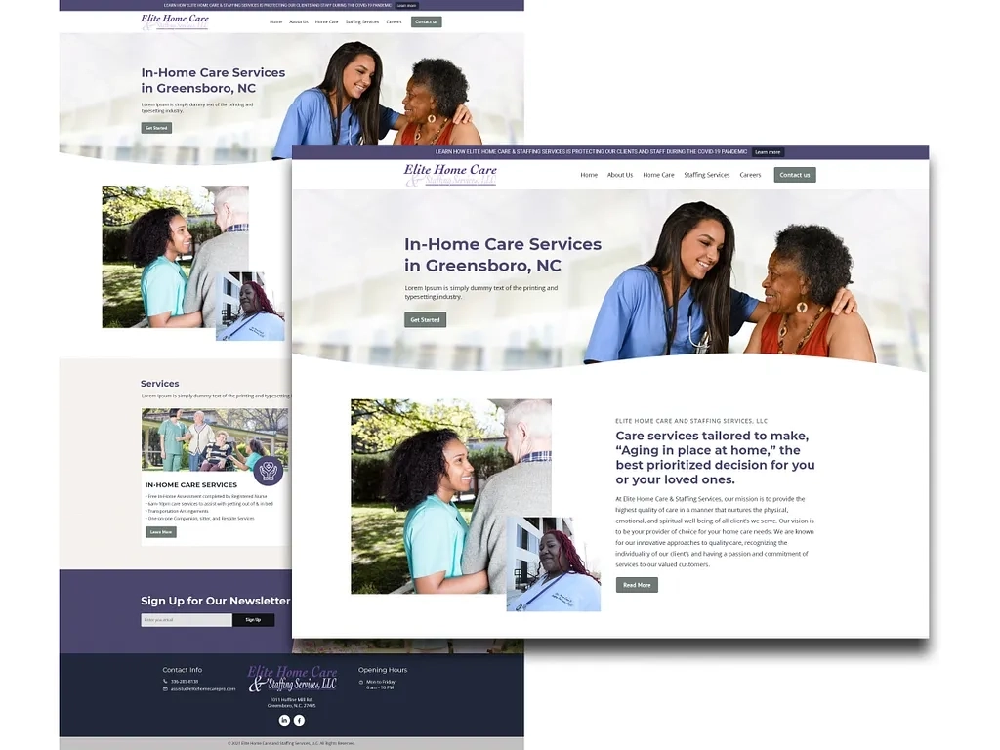

- **Colours:** deep navy with lavender accents — a striking, slightly unexpected pairing that still reads "care".
- **Typography:** modern geometric sans, tight tracking.
- **Layout:** **angled and wave section dividers** between every section; metric counters ("500+ clients served") in the hero.
- **UI detail:** gradient buttons; floating stat chips; glossy card shadows.
- **Imagery:** polished lifestyle photography in geometric crops.
- **Signature moves:** drama through colour contrast — the dark navy bands make the lavender moments glow.
- **Overall feel:** agency-portfolio polish; impressive at first glance, anonymous at second.
- **Expert read:** high-gloss layering — gradients, soft shadows and floating chips build a pronounced z-axis. The angled dividers introduce diagonal tension that fights the otherwise rectilinear grid. Navy gives white text 12:1+ contrast, which is technically excellent; the gradient buttons, though, weaken affordance consistency — interactive elements stop looking like one family.
- **Vibe:** **Dimensional Layering** with **Glassmorphism** and **Gradient Mesh / Aurora** touches on a **Hero-Centric** pattern. Agency-showreel energy: cinematic, lacquered, built to win a pitch rather than to reassure a family at midnight.

## 10 · Aims Homecare concept (agency concept, UK)

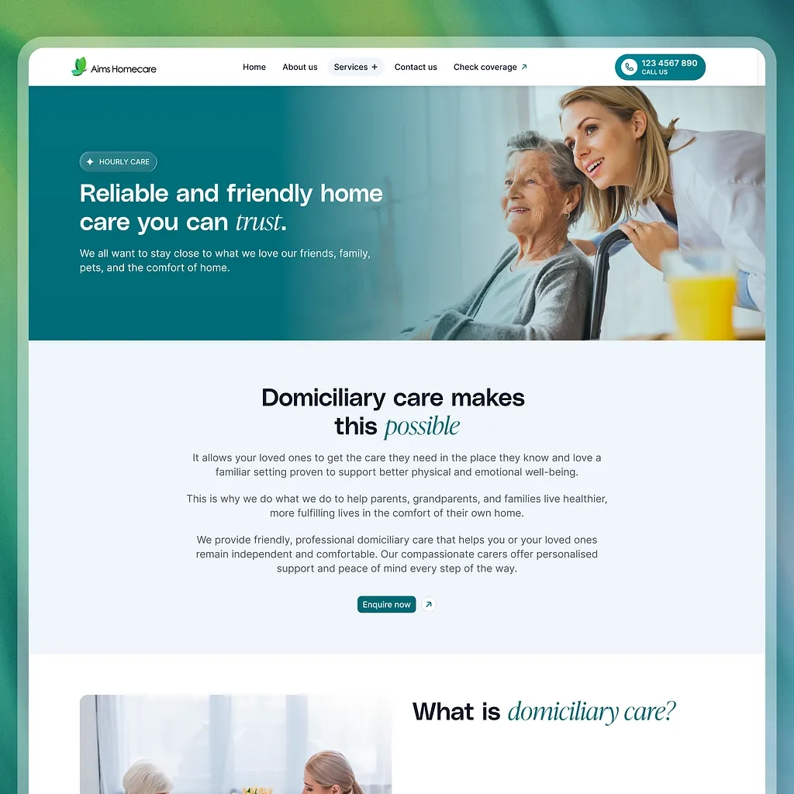

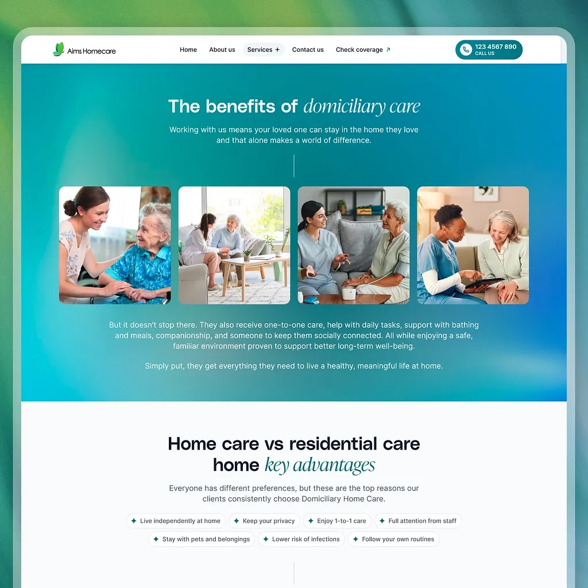

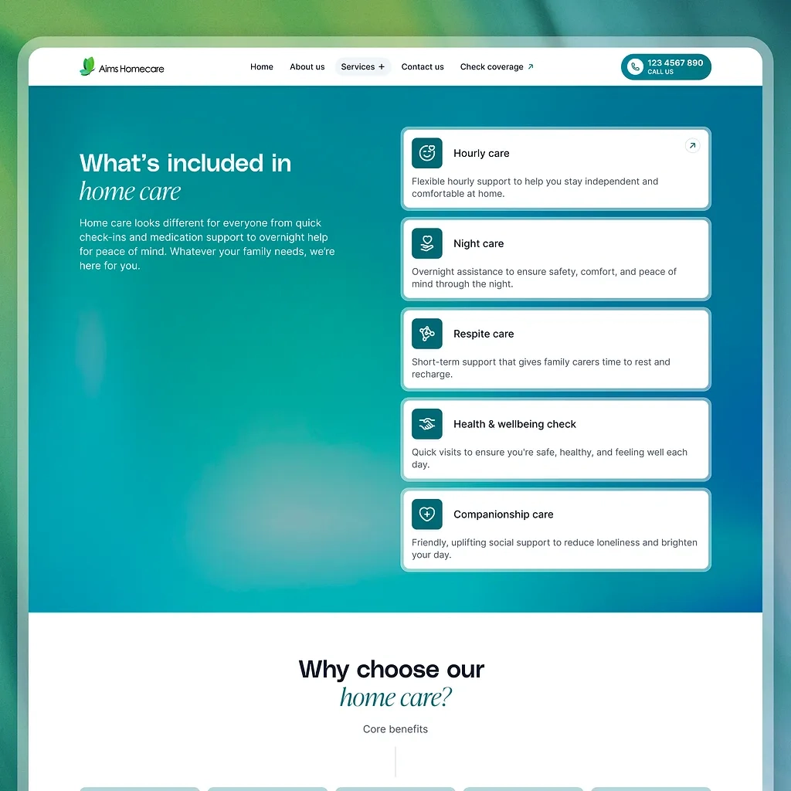

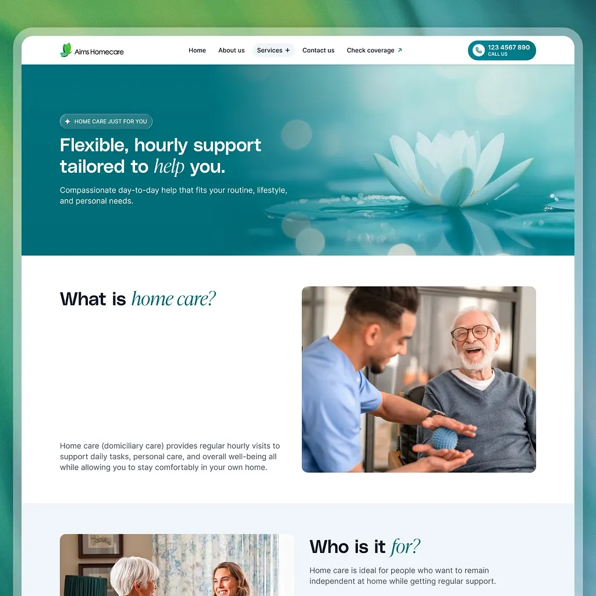

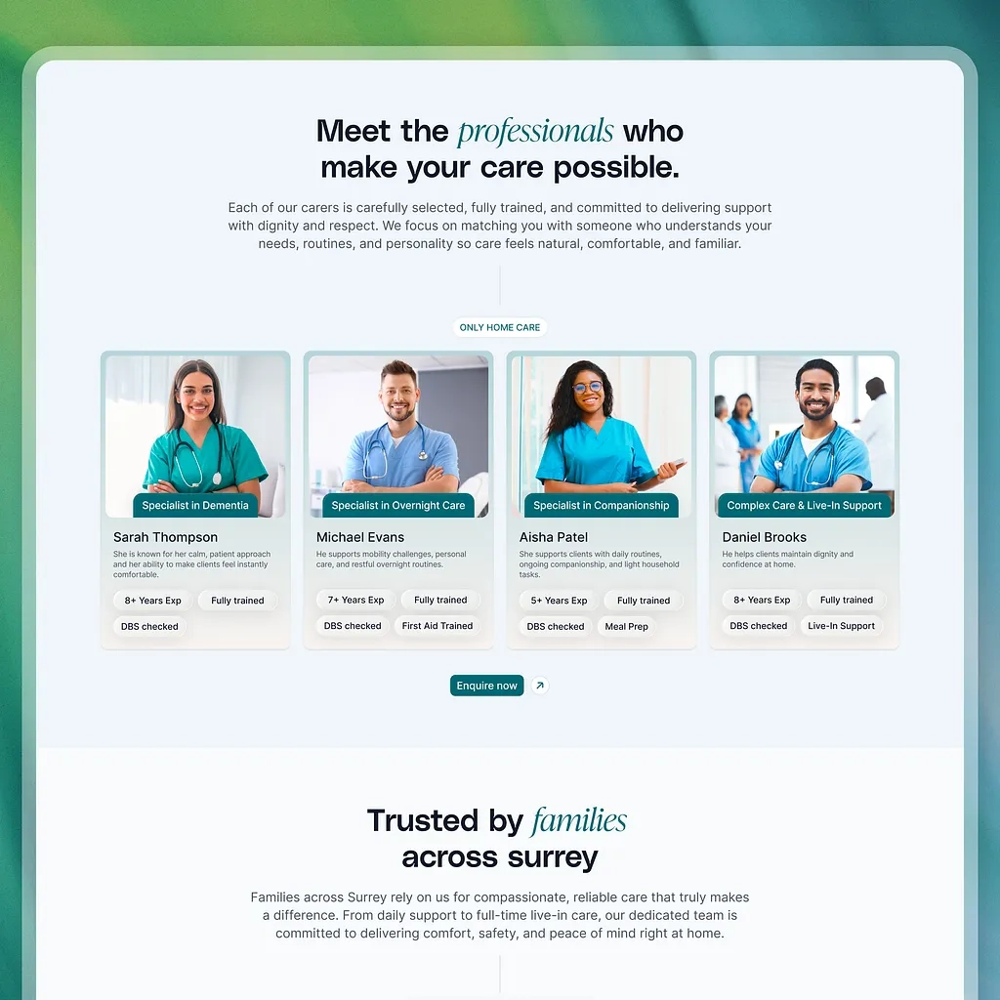

- **Colours:** teal **gradient** heroes; glassy translucent badge cards over photography.
- **Typography:** bold sans with serif italic accent words in headlines.
- **Layout:** the most complete UK concept — a hero panel with a check-coverage action, **white icon-cards sitting on a solid teal band**, and rows of pill-shaped benefit chips.
- **Hero anatomy:** two-column over the teal gradient — bold headline with the italic accent word and a short supporting line on the left, photography on the right, with the coverage action within immediate reach of the hero.
- **UI detail:** **"Check coverage ↗" as a persistent navigation item**; phone number in a header pill; tidy consistent card grids; glassmorphism badges.
- **Imagery:** warm UK-domestic photography.
- **Signature moves:** coverage checking promoted to navigation level — the "do you cover my area?" question is answerable from anywhere on the site; white cards on a saturated band create strong section identity.
- **Overall feel:** genuinely polished and trustworthy; the strongest overall UX in the concept set.
- **Expert read:** the most systemised concept in the set — one radius family, one card anatomy, consistent icon stroke weight, and a clear primary/secondary action grammar throughout. The gradient hero darkens toward the text side, a scrim technique that keeps the headline legible over photography. The glass badges are the single craft risk: translucency over photographs produces unpredictable contrast.
- **Vibe:** **Soft UI Evolution** with **Glassmorphism** accents on a **Conversion-Optimized + Trust & Authority** hybrid. Premium-UK-fintech warmth applied to care — slick, organised, reassuring the way a good banking app is reassuring.

## 11 · Premier Homecare concept (agency concept, South Florida)

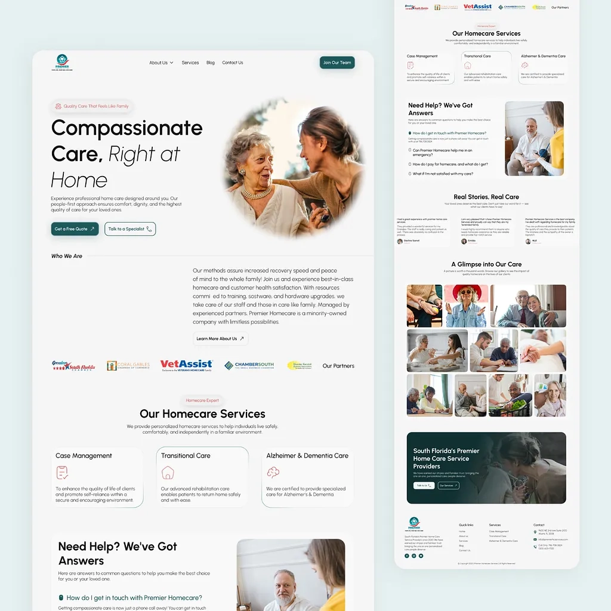

- **Colours:** sage green and warm off-white; soft, papery, low-saturation.
- **Typography:** sans body with a **serif italic accent word** in the headline ("Right at Home").
- **Layout:** a rich, complete homepage: pill eyebrow badges ("Quality Care That Feels Like Family") introducing each section → service cards with outline icons → FAQ list beside a photo → a testimonial trio ("Real Stories. Real Care.") → a **photo mosaic gallery ("A Glimpse into Our Care")** → a dark green pre-footer CTA card.
- **Hero anatomy:** eyebrow pill above the headline, the serif italic accent word inside it, the ranked dual CTA directly beneath, and a large arch-masked photo alongside.
- **UI detail:** **a ranked dual CTA** — filled "Get a Free Quote" beside outline "Talk to a Specialist"; partner-logo strip (chambers of commerce, VetAssist); **arch and oval photo masks** throughout; soft shadows.
- **Imagery:** warm, domestic, believable; the mosaic gallery feels like a family photo wall.
- **Signature moves:** the eyebrow-pill + heading + body rhythm repeated per section gives the long page a steady heartbeat; the glimpse mosaic humanises without a single word.
- **Overall feel:** warm, family-scale, credible — the closest tonal sibling to what Continuity wants to be.
- **Expert read:** the repeating section schema (eyebrow pill → heading with accent → body → action) is recognition-over-recall design — by the third section the user reads the structure pre-attentively and just skims content. Sage/cream is an analogous low-saturation harmony, with the dark green held back for the two moments that matter (header CTA, closing card). The dual CTA encodes ranking purely through fill versus outline: same size, same radius, different visual weight — the cleanest action grammar in the set.
- **Vibe:** **Soft UI Evolution** crossed with **Organic Biophilic / Nature Distilled** on a **Social Proof-Focused** pattern. Farmhouse-kitchen warmth: linen, sage, family photos on the wall — the most human-feeling page in the set.

## 12 · FirstLantic mobile (agency concept, two phone mockups)

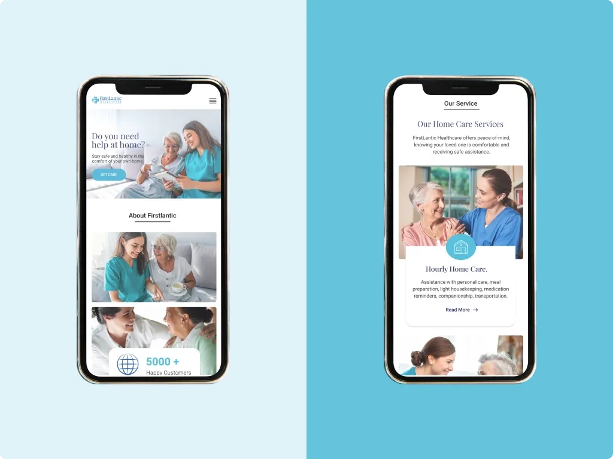

- **Colours:** clinical blue and white.
- **Typography:** **serif headings** throughout — reads "established medical office".
- **Layout:** disciplined mobile stacking — sections collapse into clean single-column card stacks with consistent spacing and no horizontal scrolling.
- **UI detail:** a **floating "5000+ Happy Customers" metric chip** overlapping the hero photo; icon-over-card service blocks (icon floating above the title); compact pill buttons.
- **Imagery:** professional, clinical-leaning photography.
- **Signature moves:** mobile-first discipline — every section earns its vertical space and the stacking order never feels accidental.
- **Overall feel:** credible but cold; competence without warmth.
- **Expert read:** thumb-zone aware — primary actions sit in the lower half of each mobile viewport. The metric chip overlapping the hero photo is a depth-anchoring trick that implants social proof pre-attentively. Serif headings plus clinical blue invoke the "established medical practice" schema: high perceived competence, low perceived warmth — the two axes of trust pulling in opposite directions.
- **Vibe:** clinical **Flat Design** with **Trust & Authority** patterning. Private-clinic waiting room: spotless, professional, air-conditioned — you trust them, and you never quite relax.

## 13 · FirstLantic desktop (agency concept, full spread)

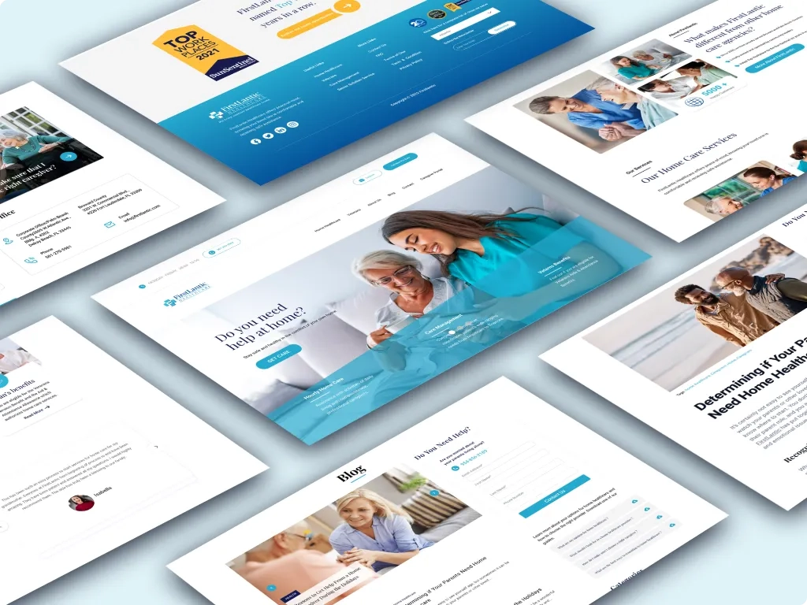

- **Colours:** **blue gradient hero**; white sections below.
- **Typography:** serif headings continue from the mobile set.
- **Layout:** conventional corporate spread — hero → services → **"Top Workplaces 2021" award badge** → blog card grid → contact forms.
- **UI detail:** real third-party award badges used as proof; long, formal contact forms; standard three-column footer.
- **Imagery:** corporate photography, team shots.
- **Signature moves:** verifiable third-party awards doing trust work that testimonials can't — external proof rather than self-description.
- **Overall feel:** established medical corporation; trustworthy to read, forgettable to look at.
- **Expert read:** a conventional 12-column corporate spread with a scrim-darkened gradient hero. The genuinely clever element is the verifiable third-party award — external validation outperforms self-description in trust psychology. Everything else is pattern-library default: equal-height blog cards, three-column footer, long formal forms.
- **Vibe:** corporate **Flat Design**, **Trust & Authority** pattern, no stylistic signature. Regional-hospital-website energy: institutional, procedural, safe, forgettable.

---

## Expert craft notes (cross-set)

The deeper systems underneath the surfaces — what a design audit of all thirteen reveals.

### Grid and composition

- Every concept sits on a ~12-column grid with content width around 1100–1200px and generous outer margins; heroes split roughly 55/45 or 60/40 text-to-image.
- Card grids run 3-up at desktop collapsing to 1-up on mobile; the strong concepts keep equal card heights through a fixed card anatomy, not stretched boxes.

### Spacing rhythm

- The polished concepts breathe at ~96–128px section padding with a consistent 8pt internal rhythm; the live US sites compress to 56–80px and feel busier for it.
- Whitespace tracks perceived price: plum NDIS and Premier carry the most air and read the most premium — generosity of space is the cheapest luxury signal in the set.

### Typographic systems

- The readable references hold body at 16–18px, ~1.5–1.6 line-height, 60–70ch measure; Visiting Angels breaks all three and is the hardest read.
- Display scales run modest ratios (~1.2–1.33) — calm hierarchies without giant jumps. The concepts create heading contrast through style (the serif italic word) and colour, not extreme size.

### Colour proportion

- The best pages approximate 60/30/10: neutral base / tinted bands plus photography / one saturated brand accent. The CTA is reliably the single most saturated element in any viewport.
- Saturation discipline is what separates premium from template: Nurse Next Door and the plum concept commit everything to one hue; Comfort Keepers and Blue Water spend saturation everywhere and cheapen it.

### Shape and depth language

- Strong concepts hold ONE radius family — pills for chips and buttons, a single mid radius for cards and photo masks. Mixed radii (Comfort Keepers) instantly read unsystemised.
- Two depth schools exist in the set: flat-with-borders-and-tints (plum NDIS, Premier, the heritage sites) versus glossy z-axis (Elite, Aims' glass, FirstLantic's floating chips). Flat consistently reads calmer and more trustworthy in this sector.

### Photography art direction

- The convincing photos share a grammar: natural domestic light, warm grade, two people mid-interaction rather than posing to camera, hands and faces, kitchen tables and sofas — and crops that leave clear space for headlines.
- The stock tells are equally consistent: studio lighting, teeth-forward smiles at the lens, clinical settings. Comfort Keepers and FirstLantic show how quickly that reads cold.

### Conversion and UX grammar

- The recurring grammar across the strong references: answer coverage and audience before any scroll → one clearly primary action per viewport → phone permanently visible in the chrome → close on a dark statement band carrying the final CTA.
- Section schemas repeat deliberately (Premier's eyebrow rhythm, Aims' card anatomy) so the user learns the page once and then skims — recognition over recall, applied at page scale.

### Accessibility observations

- Text-over-image is handled with scrims or solid panels in the strong references; the set's contrast failures are the glass badges (Aims) and light-teal text (Blue Water).
- Touch targets and form fields are generous in the concepts; the legacy live sites (Visiting Angels, Griswold) rely on dense link lists that punish imprecise motor control — exactly the audience they serve.

## The vibe synthesis (UI UX Pro Max terms)

Classified with the [UI UX Pro Max](https://github.com/nextlevelbuilder/ui-ux-pro-max-skill) style taxonomy (67 named UI styles + landing-page patterns), the set resolves into a clear design-system recommendation:

- **STYLE:** the warm winners (plum NDIS, Premier, Aims at its best) converge on **Soft UI Evolution** — soft depth, calming, premium feel — tempered by **Accessible & Ethical** and a touch of **Organic Biophilic** warmth. The cold or template-ish references are exactly the ones reaching for **Glassmorphism**, **Gradient Mesh / Aurora** or bare corporate **Flat Design**.
- **PATTERN:** **Hero-Centric + Social Proof**, with **Trust & Authority** elements woven in — emotion-led hero, CTA above the fold, trust evidence and testimonials carrying the middle of the page, the CTA repeated after them.
- **COLOUR MOOD:** warm, low-saturation base with one committed brand hue; in every reference that feels premium, the CTA is the page's saturation peak and nothing competes with it.
- **TYPOGRAPHY MOOD:** humanist warmth over geometric cool; elegance achieved through restraint and spacing rather than display-size drama.
- **KEY EFFECTS:** gentle hover states and 150–300ms transitions only; the references that add parallax, reveals or floating layers all land on the cold side of the set.
- **ANTI-PATTERNS the weak references prove:** purple/pink AI gradients, harsh animation, neon saturation, metric-chip heroes, glass over photography, decoration doing the warmth instead of photography — the same list the skill itself flags for healthcare and wellness products.

## Patterns across the set

Observations that hold across all thirteen, useful when designing fresh:

- **The warmest sites pair a calm UI with emotional photography** — Home Instead and Premier let real domestic photos carry the feeling while the interface stays quiet. Sites that lean on colour or illustration for warmth (Comfort Keepers, Blue Water) read more template-like.
- **The strongest brands commit to one owned colour** — Nurse Next Door's pink and the plum concept's purple are memorable precisely because everything else stays neutral.
- **Full-bleed colour bands are the dominant sectioning device in the concepts** — the plum NDIS and Aims concepts both structure the page with alternating tints and one dark statement band, rather than borders or dividers.
- **The phone is treated as the primary conversion path on the live sites** — Visiting Angels most extremely, but every live competitor keeps a number in the header chrome.
- **Coverage ("do you serve my area?") and audience ("who is this for?") are the two arrival questions** — the best references answer one or both before any scroll (Home Instead's audience chips, Aims' nav-level coverage check, Right at Home's location-first architecture).
- **Hero anatomy is near-identical across the strong concepts** — a two-column composition: headline (usually with one accented word) + short supporting line + action pair on the left, one large masked photo on the right, often sitting on a tinted panel or colour band (plum NDIS, Aims, Premier).
- **The strong concepts all end on a dark statement band** — plum NDIS's dark plum pre-footer, Premier's dark green CTA card: one saturated full-bleed moment holding the final call to action just before the footer.
- **Recurring 2026-concept trends:** serif italic accent words in headlines (plum NDIS, Aims, Premier), gradients and glass effects (Aims, Elite, FirstLantic desktop), pill chips and eyebrow badges (nearly all concepts), floating metric chips (Elite, FirstLantic), and curved/organic dividers (Blue Water, Elite). Worth knowing these are *trends* — they signal "2026 agency concept" as much as they signal quality.